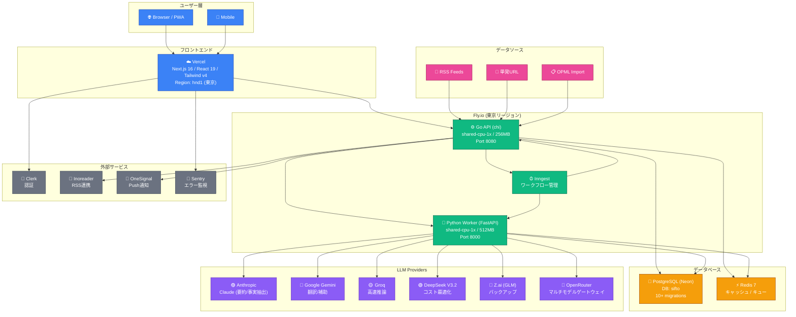

# Sifto Architecture

## Infrastructure Diagram



## 処理フロー

```
1. 収集    RSS/URL/OPML → Go API → Ingestion
2. 抽出    Python Worker → 本文抽出 → 事実抽出
3. 要約    LLM (Anthropic/DeepSeek) → 要約生成 → 品質チェック
4. 配信    Inngest → ダイジェスト生成 → OneSignal Push / Email
5. 閲覧    Next.js → ブリーフィング / Today Queue / インラインリーダー
6. 問い合せ AI Ask (RAG) → 記事検索 → LLM回答
```

## LLM 使用戦略

| 用途 | プライマリ | バックアップ |
|---|---|---|
| 事実抽出 | Anthropic Claude | DeepSeek V3.2 |
| 要約 | Anthropic Claude | Google Gemini |
| ダイジェスト | Anthropic Claude | Groq |
| 翻訳 | OpenRouter | - |
| Ask (質問応答) | ユーザー選択 | - |

## デプロイ構成

| コンポーネント | プラットフォーム | Region | スペック |
|---|---|---|---|
| Web (Next.js) | Vercel | hnd1 (東京) | - |
| API (Go) | Fly.io | nrt (東京) | shared-cpu-1x / 256MB |
| Worker (Python) | Fly.io | nrt (東京) | shared-cpu-1x / 512MB |
| Inngest | Fly.io | nrt (東京) | - |
| PostgreSQL | Neon (Serverless) | - | - |
| Redis | - | - | - |

## 特徴

- **マルチLLM戦略**: コストと品質のバランスを用途別に最適化
- **Inngestベースのワークフロー**: 非同期タスクの信頼性高いオーケストレーション
- **東京リージョン偏重**: API・Worker・Web全て東京近辺（低レイテンシ）
- **Fly.io auto-stop**: 零時帯は機械を停止してコスト削減
